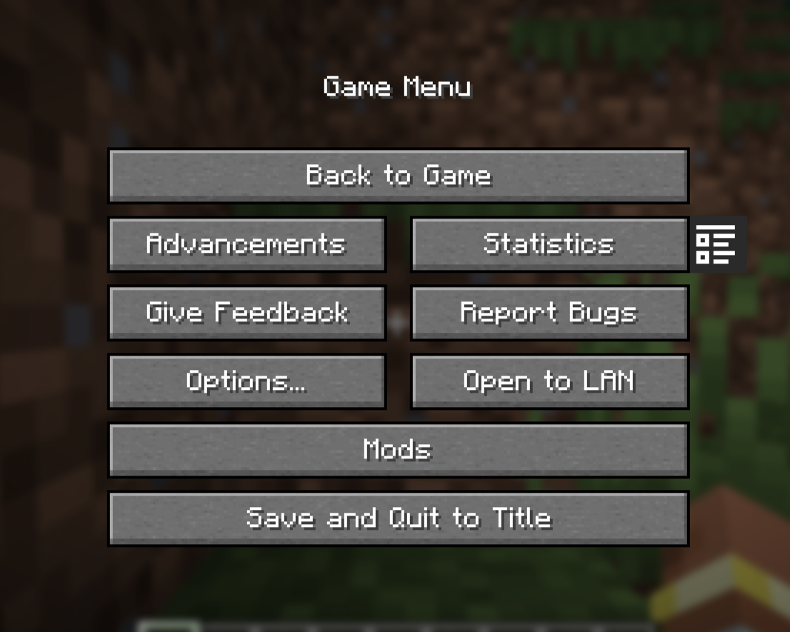
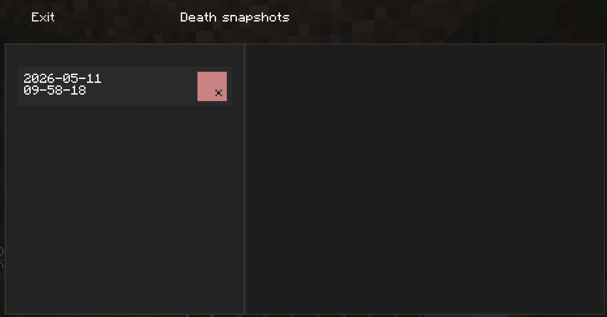
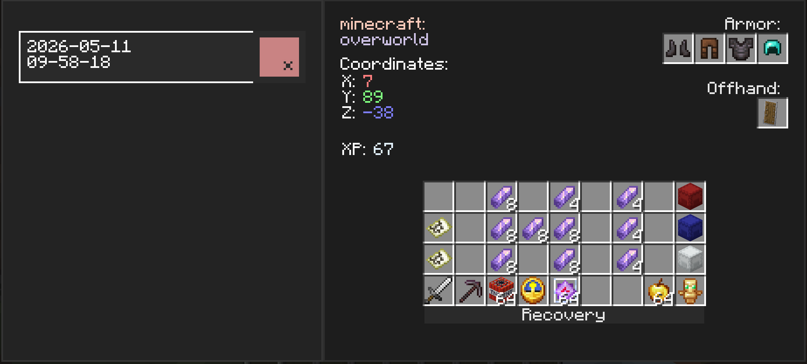
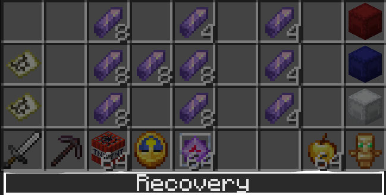
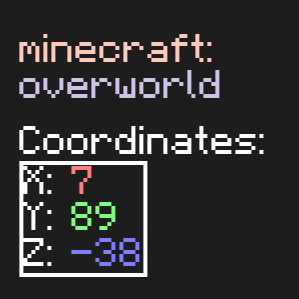
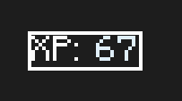
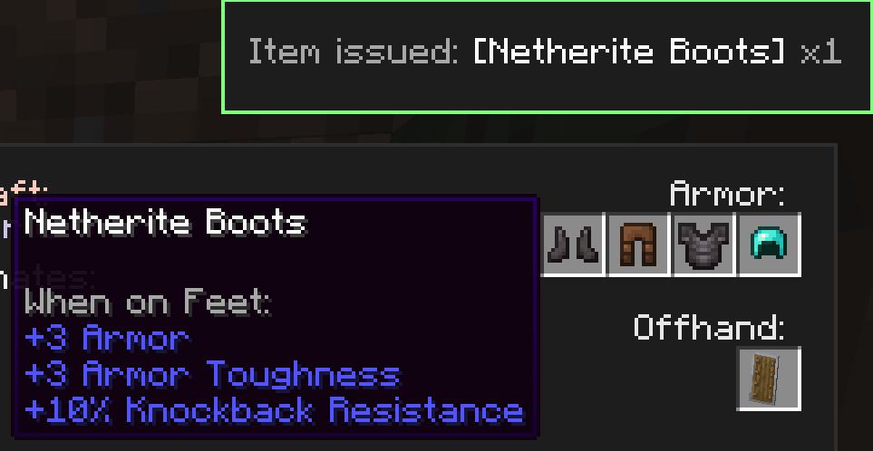
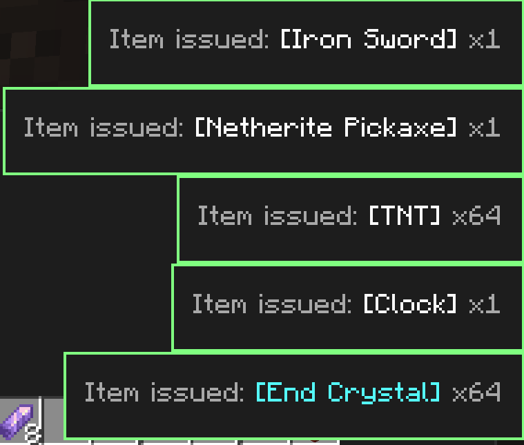

# *EN*  

----
# Death Memo

A client-side NeoForge mod that automatically saves snapshots of your inventory upon death and allows you to browse them later.  
For server operators or singleplayer with cheats enabled, it also provides one‑click item recovery, teleportation to the death location, and experience restoration.

## Features

- **Automatic death snapshots** – When you die, your armor, offhand, inventory, experience, coordinates and dimension are saved immediately.
- **Local storage** – Snapshots are stored in the `deathmemo/` folder inside the Minecraft game directory, separately for each world/server.
- **In‑game history browser** – A special screen accessible from the pause menu (next to the “Stats” button) shows all your death records.  

<!--suppress CheckImageSize -->

  
  

  

- **Detailed view** – Click on a date and time entry to see:
  - Equipped armor, offhand item, and all 36 inventory slots
  - Coordinates (X, Y, Z) and dimension
  - Experience points at the moment of death  

- **Operator recovery tools** (requires permission level 2 or cheats enabled in singleplayer):
  - **Recovery** – request all items from the selected snapshot.  
    
  
  - **Teleportation** – instantly teleport to the death location.  
    
  
  - **Experience restoration** – restore lost experience points.  
    
  
  - **Request a specific item** – click on any slot in the history to ask the server to give you that item (if permitted).  
    
  
  - **Visual feedback** – custom colored toast notifications confirm whether your recovery request was approved or denied.  
    
  
- **Flexible UI** – snapshots can be safely deleted individually.
- **Client‑server interaction** – uses custom packets for secure command execution and item recovery.

## Requirements

- **Minecraft** 1.21 or newer (NeoForge)
- **NeoForge** (latest recommended version)
- **owo-lib** (required for the UI framework) – [Modrinth](https://modrinth.com/mod/owo-lib) / [CurseForge](https://www.curseforge.com/minecraft/mc-mods/owo-lib)

## Installation

1. Install NeoForge for your Minecraft version.
2. Download the latest `deathmemo-*.jar` from the [Releases](https://github.com/MrDemogg/Deathmemo/releases) section or build from source.
3. Place the mod in your `mods/` folder.
4. Make sure you also have **owo-lib** installed.
5. (Optional) Place the same mod on a dedicated server if you want the recovery features to work in multiplayer.

## How It Works

- **Inventory snapshots** are serialized to JSON using Minecraft’s built‑in `ItemStack.CODEC` and saved under `deathmemo/<place>/`.
- The “place” identifier is derived from the server IP (multiplayer) or the world save name (singleplayer), ensuring proper separation.
- The UI is built with **owo-lib**, leveraging an XML model (`snapshots_screen.xml`) and custom components (`HoverAwareFlowLayout`, `OneLineLabel`).
- Networking uses three custom payloads:
  - `RequestItemPayload` – the client requests an item.
  - `CommandRequestPayload` – the client requests a command (teleport/XP).
  - `RequestResponsePayload` – the server replies with success/failure and a message shown in a toast.
- The mod is primarily client‑side, but server‑side handlers are registered so that recovery features work in multiplayer.

## Credits

- Developed by the indie team **AronHuisIn** (main package `co.AronHuisIn.deathmemo`), developer VPKesha (GitHub: MrDemogg).
- Uses the [owo-lib](https://github.com/wisp-forest/owo-lib) library for the UI framework.

## License

This project is distributed under the CC BY-NC 4.0 license.  
You are free to use, modify, and distribute it in accordance with the license file.  
However, when distributing this project or its derivatives, you must give appropriate credit to the original author (VPKesha a.k.a. MrDemogg).  
Commercial use of the code from this project is prohibited without the author’s permission.  
[Read more](https://github.com/MrDemogg/Deathmemo?tab=License-1-ov-file#readme)

---

*Found a bug or have a suggestion? Feel free to open an issue on the GitHub repository.*  

---
# *RU*

---

# Death Memo

Клиентский мод для NeoForge, который автоматически сохраняет снимки вашего инвентаря при смерти и позволяет просматривать их позже.  
Для операторов серверов или одиночной игры с включёнными читами также доступно восстановление предметов, телепортация на место гибели и возврат опыта в один клик.

## Возможности

- **Автоматические снимки при смерти** – Когда вы умираете, ваша броня, вторая рука, инвентарь, опыт, координаты и измерение сразу сохраняются.
- **Локальное хранение** – Снимки хранятся в папке `deathmemo/` внутри игровой директории Minecraft отдельно для каждого мира/сервера.
- **Внутриигровой просмотр истории** – Специальный экран, доступный из меню паузы (рядом с кнопкой «Статистика»), показывает все ваши записи о смертях.
<!--suppress CheckImageSize -->

  
  

  

- **Детальный просмотр** – Нажмите на запись с датой и временем, чтобы увидеть:
    - Надетую броню, предмет во второй руке и все 36 ячеек инвентаря
    - Координаты (X, Y, Z) и измерение
    - Количество опыта на момент смерти  

  

- **Инструменты восстановления для операторов** (требуется уровень прав 2 или включённые читы):
    - **Восстановление** – запрос всех предметов из выбранного снимка обратно.  
      
  
    - **Телепортация** – мгновенное перемещение на место смерти.  
      
  
    - **Восстановление опыта** – выдача потерянных очков опыта.  
      
  
    - **Запрос отдельного предмета** – клик по любому слоту в истории отправляет запрос серверу на выдачу конкретного предмета (при наличии прав).  
      
  
    - **Визуальная обратная связь** – кастомные цветные уведомления-тосты подтверждают, одобрен ли ваш запрос на восстановление, или отклонён.  
      
  
- **Гибкий интерфейс** – снимки можно безопасно удалять по одному.
- **Клиент-серверное взаимодействие** – используются собственные пакеты для безопасного выполнения команд и восстановления предметов.

## Требования

- **Minecraft** 1.21 или новее (NeoForge)
- **NeoForge** (последняя рекомендованная версия)
- **owo-lib** (необходима для UI-фреймворка) – [Modrinth](https://modrinth.com/mod/owo-lib) / [CurseForge](https://www.curseforge.com/minecraft/mc-mods/owo-lib)

## Установка

1. Установите NeoForge для вашей версии Minecraft.
2. Скачайте последний файл `deathmemo-*.jar` из раздела [Релизы](https://github.com/MrDemogg/Deathmemo/releases) или соберите из исходников.
3. Поместите мод в папку `mods/`.
4. Убедитесь, что у вас также установлена библиотека **owo-lib**.
5. (Опционально) Установите этот же мод на выделенный сервер, чтобы функции восстановления работали в многопользовательской игре.

## Как это работает

- **Снимки инвентаря** сериализуются в JSON с использованием встроенного в Minecraft кодека `ItemStack.CODEC` и сохраняются в `deathmemo/<место>/`.
- Идентификатор «места» получается из IP сервера (для мультиплеера) или имени сохранения мира (для одиночной игры), обеспечивая разделение.
- Интерфейс построен на **owo-lib**, используя XML-модель (`snapshots_screen.xml`) и собственные компоненты (`HoverAwareFlowLayout`, `OneLineLabel`).
- Сетевое взаимодействие используют три кастомных пакета:
    - `RequestItemPayload` – клиент запрашивает предмет.
    - `CommandRequestPayload` – клиент запрашивает выполнение команды (телепортация/опыт).
    - `RequestResponsePayload` – сервер отвечает успехом/неудачей и сообщением, которое показывается в тосте.
- Мод в первую очередь клиентский, но регистрация серверных обработчиков позволяет функциям восстановления работать в мультиплеере.

## Авторство

- Разработано инди-командой **AronHuisIn** (основной пакет `co.AronHuisIn.deathmemo`), разработчик VPKesha (Github: MrDemogg).
- Использует библиотеку [owo-lib](https://github.com/wisp-forest/owo-lib) для UI-фреймворка.

## Лицензия  

Проект распространяется под лицензией CC BY-NC 4.0  
Вы можете свободно использовать, менять и распространять его в соответствии с файлом лицензии.  
Однако при распространении этого проекта или его производных требуется указание оригинального автора (VPKesha ака MrDemogg)  
Коммерческая деятельность с использованием кода из данного проекта запрещена без разрешения автора  
[Подробнее](https://github.com/MrDemogg/Deathmemo?tab=License-1-ov-file#readme)  

---

*Нашли ошибку или есть предложение? Создайте issue в репозитории на GitHub.*  

---
